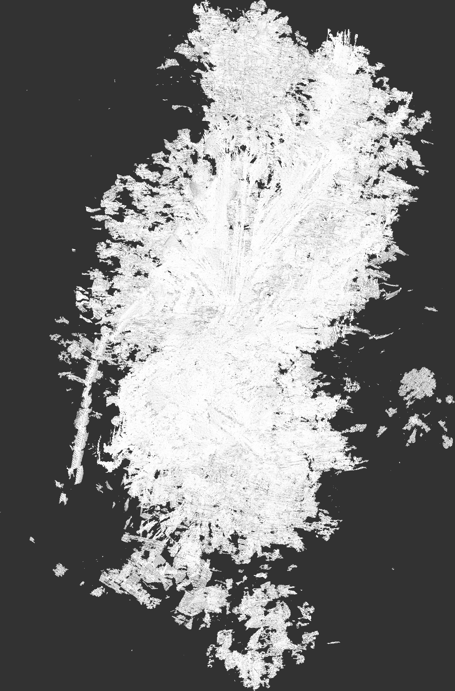
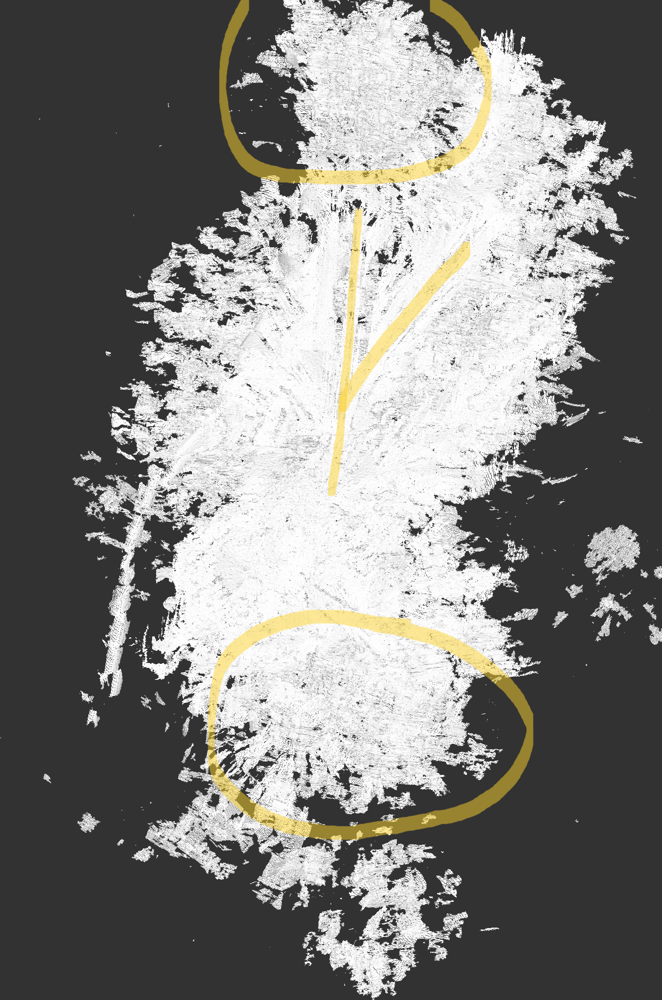

## Vesuvius Scroll Segmentation Tool

This repository contains the development of a geometry-based segmentation algorithm for the Vesuvius Challenge.
  
### Overview  
The primary purpose of the algorithm is to attempt to identify and visualize parts of the Vesuvius Scrolls where multiple separate sheets intersect or one sheet splits into separate parts. The end goal is an algorithm which can identify where this happens, and label the path that a sheet should take if it were to meet at one of these intersections. The algorithm is still in very early testing stages but is quite capable at visualizing papyrus fibers and occasionally can find sheet splits. An example of the output is below:

  
  
The output of the algorithm is currently a grayscale image. Where the brightness of a pixel is determined based on the difference in normal from that pixels voxel to a local reference normal. To put it simply, if the algorithm says that one direction is "up", then the brightness is based on how close a voxel is to facing "up", where perfect white means it faces exactly "up" and perfect black means it faces exactly "down". This way of coloring allows the algorithm to detect sharp edges, like meeting the end of a papyrus fiber. This creates essentially bubble letters of the papyrus fibers.  
  
The figure above is a 2d piece of the scroll roughly 2cm^2 in size. A few things to note in the figure is:  
1. The middle of the figure shows a sheet switch.
2. The top of the figure shows a dense grid of small papyrus fibers.
3. The bottom of the figure shows some larger papyrus fibers.  
  
The figure below highlights these regions of interest:  
  
  
  
The repository is split into a few parts. Most notably algorithm is where you will find the implementation of the algorithm used for this and all the necessary libraries borrowed from https://github.com/ScrollPrize/villa. The algorithm is under /algorithm/apps. The repository also has its own tool so these segments can be generated easily by archaeologists or hobbyists. The backend and frontend are under their own folders. Additionally a demo is available since setting up everything needed for this repository can take some time. To do so simply follow the instructions found in /frontend/README.md.  
  
The architecture of the repository is organized pretty nicely.  
  
The components of the repo are:
- frontend/: Vite/React UI (calls API via VITE_API_BASE_URL)  
- backend/: Flask API + Celery worker + Redis queue  
- algorithm/: C++ executables packaged into a Docker image; invoked by the worker  
  
The backend worker uses the Docker socket to spin up short-lived algorithm containers.  
  
### Quickstart

Setup details live in the component READMEs:
- Frontend: see `frontend/README.md`
- Backend/API/worker: see `backend/README.md`
- Algorithm image/build: see `algorithm/README.md`

At a high level you will:
1. Build the Docker images.
2. Run Redis + API + Celery worker.
3. Run the frontend (dev server or built UI).
4. Submit a segmentation job and view/download results.

### Security note

The backend/worker pattern mounts `/var/run/docker.sock` so it can launch algorithm containers. Treat the API as **trusted/private** unless you’ve put it behind proper auth/network controls.

### Status

This is a personal learning/research project and is still in early testing stages. It can visualize papyrus fibers well and can sometimes detect sheet splits, but the full “path labeling through intersections” goal is still in progress.

For more detail on any part of the stack, see the per-directory READMEs.
